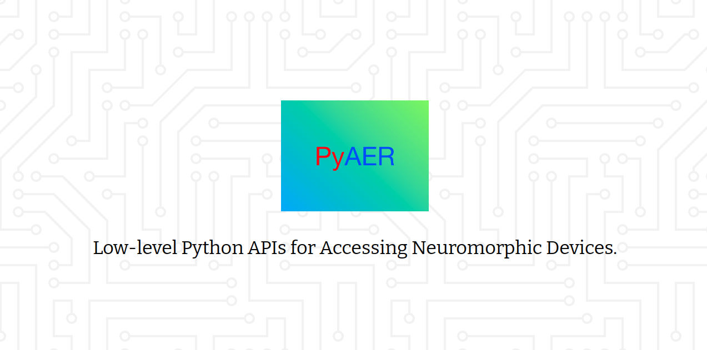

---

[](https://github.com/duguyue100/pyaer/releases/latest)
[](https://pypi.org/project/pyaer/)
[](https://github.com/duguyue100/pyaer/actions/workflows/main.yml)
[](https://github.com/duguyue100/pyaer/blob/master/LICENSE)
[](https://doi.org/10.5281/zenodo.1346279)


Special thanks to [iniVation](https://inivation.com/) for making this possible!

The project is in its Beta development stage, please submit an [issue](https://github.com/duguyue100/pyaer/issues) if you encountered a problem.

__NEWS__ As from 0.2.5, we switched CI/CD from Travis CI to Github Actions because the building on travis-ci.org is ceased. We are looking for solutions to produce ARM64 build.

## Why PyAER?

iniVation has released [DV](https://gitlab.com/inivation/dv), a new platform and an SDK for accessing and developing with event cameras.

For robotics projects, you may find [rpg_dvs_ros](https://github.com/uzh-rpg/rpg_dvs_ros) when you use ROS.

So the natural question is: why PyAER?

In a nutshell, PyAER is a combination of a Pythonic `libcaer` and a light-weight "ROS". PyAER serves as an agile package that focus on fast development and extensibility. In fact, in some scenario, e.g., edge devices, PyAER is more user friendly than other alternatives.

### Design Principle

+ Minimum installation effort.
+ Clean, simple, easy to manage.
+ Well documented, human-readable code.

## Installation

1. Install `libcaer` dependency (RECOMMEND)

    ```bash
    # for Ubuntu
    sudo apt-get install libcaer
    # for macOS
    brew install libcaer
    ```

    Update `udev` rules if you use a Linux system:

    ```bash
    $ bash <(curl -s https://raw.githubusercontent.com/duguyue100/pyaer/master/install-udev.sh)
    ```

    __NOTE__: The `libcaer` installation has taken care of the `udev` update.
    However, if the problem persists, please try it.

2. Install `pyaer` from pypi (RECOMMEND)

    ```bash
    $ pip install pyaer
    ```

3. Install `pyzmq` and `h5py`
    ```
    $ pip install pyzmq
    $ pip install h5py
    ```

    __NOTE:__ `pyzmq` is not available on ARM-based computer, you will need to build yourself.

### Development

For development purpose, you might build `pyaer` from source.
Please follow the instructions in [INSTALL_FROM_SOURCE.md](./INSTALL_FROM_SOURCE.md)

## Running Examples

+ The [scripts](./scripts) folder provides some examples for you to play with.

+ Extra more advanced demos are available at [pyaer-demo](https://github.com/duguyue100/pyaer-demo).

## Limitations and Notes

+ __2022-06-07__: We now switch to follow `libcaer` official release.

+ __2021-12-01__: For DAVIS346 Color model, we now support color events.

+ __2021-01-13__: DVXplorer cameras are officially supported
(Thanks [iniVation](https://inivation.com/))
for borrowing devices. Samsung EVK support is yet to be tested.

+ __2020-12-02__: From 0.2.0, we support a `zeromq`-based communication
module that allow users to leverage multiple processes during development.
It can support multiple devices and concurrent logging and
visualization. If you are familiar with ROS, you should
find this feature comfortable.

+ DYNAP is generally supported. We are currently looking for the correct
bias configuration mechanism so that it can easily support the use of the
device. We have mapped some core functions that are essential to device
configuration.

## Contacts

Yuhuang Hu  
Email: duguyue100@gmail.com
